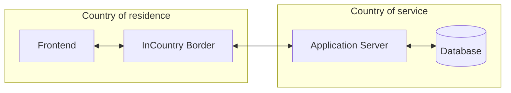

# Example application

This repository contains an example web application for contacts management mentioned in [this guide](https://docs.incountry.com/examples/integrating-incountry/). It shows different ways to integrate InCountry platform into a web app to make it compliant with personal data protection laws.

This repository contains three branches:

- [main](https://github.com/incountry/example-app): Simple web application without any interactions with InCountry platform.
- [restapi](https://github.com/incountry/example-app/tree/restapi): Compliant version of the application using [InCountry RestAPI](https://docs.incountry.com/examples/integrating-incountry/#on-demand-redaction).
- [border](https://github.com/incountry/example-app/tree/border): Compliant version of the application using [InCountry Border](https://docs.incountry.com/examples/integrating-incountry/#transparent-redaction).

## Installation

To get started, please clone the repository first by running the following command:

```bash
git clone -b border https://github.com/incountry/example-app
```

Now navigate to the project folder:

```bash
cd example-app
```

And install dependencies:

```bash
npm install
```

In order to run the application we need a simple configuration. For this version it is enough to specify only the port you want the app to listen (please replace `<your-border-url>` with an actual URL obtained on InCountry portal):

```bash
echo -e 'NODE_PORT=3000\nBORDER_URL="<your-border-url>"' > .env
```

And start the server by running

```bash
npm start
```

The application is now running, and you can navigate to `http://localhost:3000` in your browser to interact with it. 

## Structure

The version of the application in this branch uses InCountry Border, so it is compliant with data protection laws. Overall structure and request-response flow looks like this:


